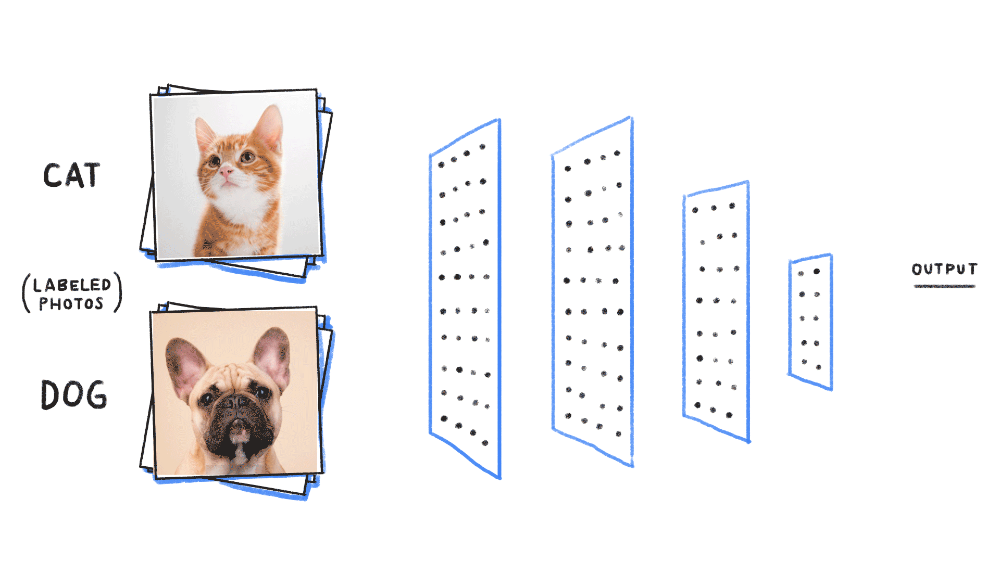
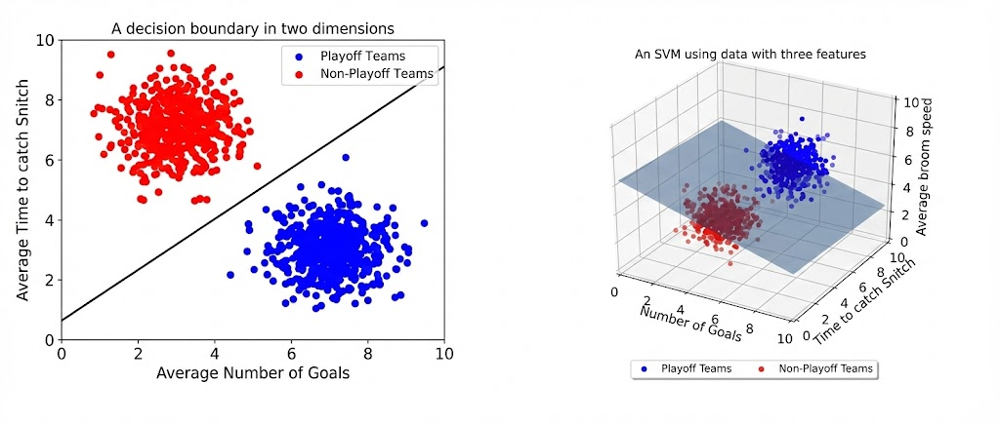
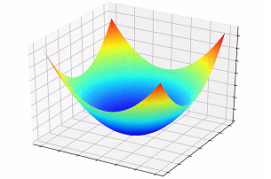
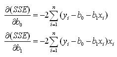
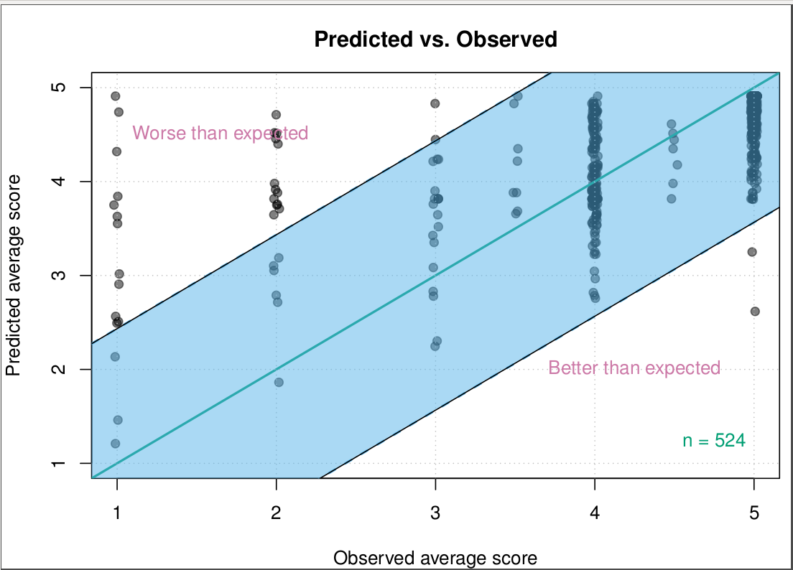
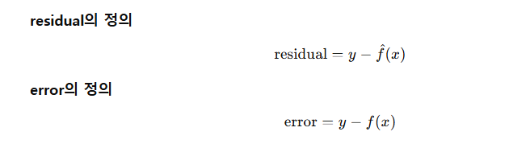
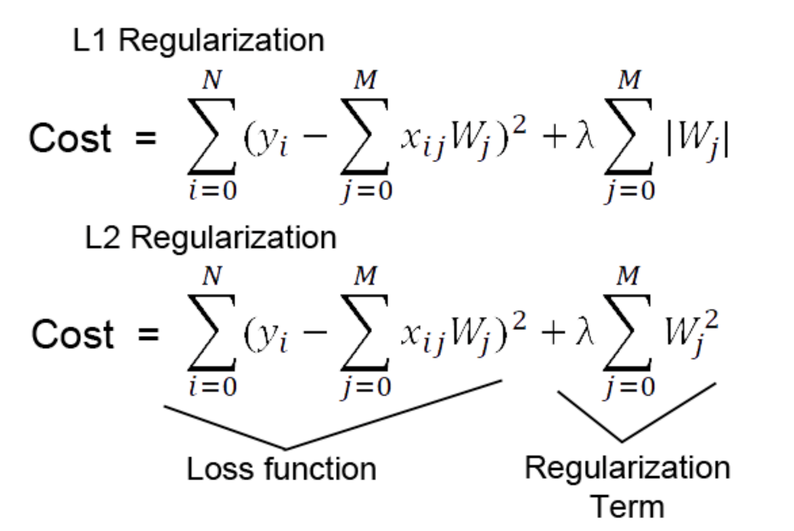
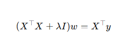
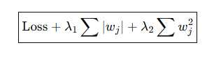

# week3 : 선형회귀와 분류

## terminology

* $\hat{y}$ : 추정값 (Predicted Value)
* $\bar{y}$ : 평균값 (Mean Value)
* $y$ : 실제값 (Actual Value)

## Random Error : 입실론 e
train/val 을 어떻게 나누던 e 의 분포는 다음과 같다
* E(e) = 0
* Var(e) = σ²
* e ~ N(0, σ²)

### 모델의 기대값

기대값 
$$ E(Y_i) = E(\beta_0 + \beta_1 X_i + \epsilon_i) $$
$$ = \beta_0 + \beta_1 X_i + E(\epsilon_i) $$
$$ = \beta_0 + \beta_1 X_i $$

### 모델의 분산
분산
$$ Var(Y_i) = Var(\beta_0 + \beta_1 X_i + \epsilon_i) $$

여기서 중요한 전제:
* $X_i$는 고정값(fixed)으로 취급
* $\beta_0, \beta_1$는 상수

그래서:
$$
Var(\beta_0 + \beta_1 X_i) = 0
$$

결과적으로:
$$
Var(Y_i) = Var(\epsilon_i) = \sigma^2
$$

### **의미**
* 모델의 불확실성은 전부 오차항에서 온다

## keyword
- Loss Function
- LR(linear regression), Logit(logistic regression), SVM(support vector machine)
- Ridge, Lasso, Elastic Net 
- Bias-Variance trade-off

## Loss function
* 로스 함수
> 문제를 정의하고 ML / DL 모델을 통해 최적화 하는 것

* MSE : mean squared error (평균 제곱 오차)  
$$ MSE = \frac{1}{n} \sum_{i=1}^{n} (y_i - \hat{y}_i)^2 $$

* `실제값-예측값`의 제곱의 평균 
 
$$ SSE = \sum_{i=1}^{n} (y_i - \hat{y}_i)^2 $$
$$ MSE = \frac{1}{n} \sum_{i=1}^{n} (y_i - \hat{y}_i)^2 $$
* SSE 를 평균 낸 값
* ML/DL 에서는 SSE 보단 MSE를 많이 사용
    * 데이터 크기에 독립 (n으로 나눔)
    * gradient 관점: batch 크기가 작아서 학습 안정성이 높다 (파라미터를 업데이트 하는 단위)

## linear regression
* 선형회귀
* data 들을 가장 잘 설명하는 함수를 찾는 것
> univariate LR  
> Multivariate LR  
  

* underfitting  
* overfitting

## logistic regression
* 로지스틱 회귀 : 선형결합을 확률로 변환해서 이진분류를 수행하는 선형 분류 모델
* classification 모델 (0 or 1)
* 핵심 함수: 시그모이드

| 항목   | 선형회귀 | 로지스틱 회귀       |
| ---- | ---- | ------------- |
| 문제   | 회귀   | 분류            |
| 입력 | 선형결합 / vector | 선형결합 / vector |
| 함수   | 항등식   | 시그모이드         |
| 출력   | 실수   | 확률 [0,1]         |
| 해석   | 단일 값 예측 | 확률에 따른 분류     |

> 강아지 고양이 분류 예시

1. 이미지 input
2. SVD 통해서 선형 차원 축소 &rarr; ($w^T x$)
3. 각 feature(귀 모양, 코...)에 주어진 가중치의 선형결합을 합산 &rarr; ($w^T x + b$)
4. 시그모이드 함수로 확률에 따른 분류

---

## SVM : Support Vector Machine

* 클래스 간 경계를 나누는 모델
    * 클래스는 feature 공유 집단
> 두 클래스 사이의 ‘여유 공간(마진, margin)’을 최대화하는 선  

1. 두 클래스 사이에 놓일 수 있는 **모든 가능한 선(초평면)** 을 고려
2. 각 선에 대해
3. 가장 가까운 데이터 점까지의 거리(마진)를 계산
4. 그 최소 거리(마진)가 최대가 되는 선을 선택

5. 이때 가장 가까운 점들이 바로 `support vectors`

Loss f : hinge function  
(의미: support vectors 와 선의 거리를 최대화)  
* $\text{argmin}$ 일텐데 의미적인 부분에서 설명한 것

---
## Least square / Unbiased estimation

* SSE 를 최소화
1. 현재 Loss function을 SSE 로 잡음 
2. 이건 squared sum error 니깐 quadratic form 으로 나옴
3. convex 한 형태임 제곱항 &rarr; 미분 시 다음과 같이 나옴

4. local minimum 이 global minimum 이고, 미분값이 0 인 지점이 최소값이다. 
5. least square estimation 라고 함(unbiased estimation &rarr; 미분하기 때문에 bias 항에 무관)

## error 와 residual 의 차이점

* 파란 부분: 허용가능한 residual
* 점: 관측된 데이터
* error 관측되지 않음

1. error : 이론적 개념 , 현실에 존재하지만 우리가 관측할 수 없는 개념 ( 어 왜 틀렸지? 이유를 못찾음 : e , 통계적으로 확률변수의 개념이라, 시행 후에도 분리해서 관측 할 수 없음 -> random seed 같은 것)

2. residual : 실제 데이터로 부터 계산한 , 관측가능한 오차의 **추정치** ( 입실론 으로 표현)

**정리**
* **Error($\epsilon$)**: 데이터 생성 과정에서 정의되는 확률변수로, 각 관측치에 대해 실현값이 존재했을 수 있으나 진짜 함수 $f(x)$를 알 수 없기 때문에 분리하여 관측할 수 없다.
* **Residual($r$)**: 추정된 모델 $\hat{f}(x)$를 기준으로 계산한 관측 가능한 값으로, Error를 직접 볼 수 없기 때문에 이를 대신하는 통계적 대리값(proxy)이다. 하지만 현실 데이터가 노이즈가 존재하는 한, residual로 error를 대체할 수 없다

---
## Regularization(규제)
### Ridge, Lasso, Elastic Net
> Loss Function에 “벌점(penalty)”을 추가하는 것
* 왜 벌점을 추가하는가?
  * 모델이 “데이터를 너무 잘 설명하려다 생기는 과적합(overfitting)”을 막기 위해 추가함  

### Lasso (L1 규제)
* Cost Function에 가중치의 절대값의 합을 추가
* $w_j$ : 모델 파라미터(계수)
* $\lambda$ : 규제 강도 (클수록 규제 강함)
>L1 규제는 “계수를 조금이라도 쓰면 비용이 든다”는 규칙을 만들고
그 비용을 감당할 만큼 도움이 안 되는 변수는
차라리 0으로 만드는 게 최적이 되게 설계되어 있다.
* model 을 학습시키면 cost 함수를 줄이는 방향으로 학습되기에 필요없는 변수는 사용하지 않는 현상 일어남(최적화) 

### Ridge (L2 규제)
* Cost Function에 가중치의 제곱의 합을 추가
* $w_j$ : 모델 파라미터(계수)
* $\lambda$ : 규제 강도 (클수록 규제 강함)
> “모든 가중치를 조금씩만 써라”  
큰 가중치 → 큰 벌점  
작은 가중치 → 거의 벌점 없음
#### $w = 0$ 을 만들지 않음
* Cost Function를 미분해서 해를 구할때 $w=0$ 이면 
 이므로 $w=0$ 이라면 의미 없는 식이 됨
* "각 변수를 조금씩만 사용해라" 라는 결론이 나게 됨

### Elastic Net
* Ridge와 Lasso의 조합
#### L1(Lasso)의 문제
* 변수 선택은 잘함
* 상관된 변수들 중 하나만 남기고 나머지는 버림
* 어떤 변수가 남을지 불안정
#### L2(Ridge)의 문제
* 안정적
* 하지만 변수를 안 버림
* 해석력 떨어짐
#### Elastic Net 필요성

> 변수는 가능하면 적게 써라 (L1)
> 극단적으로 한 개에 몰지 말고
> 여러 개에 나눠 써라 (L2) 라는 의미

| 구분        | **L1 규제 (Lasso)** | **L2 규제 (Ridge)** | **Elastic Net**          |              |              |     |                         |
| --------- | ----------------- | ----------------- | ------------------------ | ------------ | ------------ | --- | ----------------------- |
| 기본 아이디어   | 불필요한 변수 제거        | 가중치 크기 억제         | 선택 + 안정성                 |              |              |     |                         |
| 계수 0 가능성  | 높음 (정확히 0)    | **거의 없음**             | 있음                       |              |              |     |                         |
| 변수 선택     | **가능**            | 불가능               | 가능                       |              |              |     |                         |
| 가중치 분배    | 한두 개에 집중          | 여러 변수에 분산         | 균형                       |              |              |     |                         |
| 상관된 변수 처리 | 하나만 남김 (불안정)      | 함께 유지             | **함께 유지 (group effect)** |
| 모델 안정성    | 낮음                | **높음**            | 중간~높음                    |
| 계산 안정성    | 보통                | **매우 좋음**         | 좋음                       |
| 주 사용 목적   | feature selection | overfitting 방지    | 고차원 + 상관 변수              |

## bias variance trade-off (모델의 설명력)
$$ MSE = \underbrace{\text{Bias}^2}_{\text{단순함의 대가}} + \underbrace{\text{Variance}}_{\text{민감함의 대가}} + \underbrace{\text{Noise}}_{\text{줄일 수 없음}} $$

* 쉽게 말하자면 사실 `good fit / robust`한 model 을 만드는 것
* 좋은 model 이란 `mse`가 낮다 라고 말할 수 있음

#### 정의
- **Bias**: 모델의 *평균 예측값*과 *실제 함수* 사이의 차이  
  $$
  \text{Bias} = \mathbb{E}[\hat y] - y
  $$

  * $y = \beta_1 x + \beta_0$의 $\beta_0$가 아님  
  * 파라미터가 아님
  * 모델이 underfitting 한 경우, 단순함에 의해 생기는 실제 f(x)와의 차이
---

- **Variance**: 학습 데이터가 달라질 때 *예측값*이 얼마나 변하는지  
  $$
  \text{Variance} = \mathbb{E}\big[(\hat y - \mathbb{E}[\hat y])^2\big]
  $$
  * 통계의 분산의 개념이 아님, 형식은 분산이지만, 모델 예측의 분산임
  * 각 모델이 평균 예측에서 얼마나 벗어나는가?
  * 우리는 model 의 성능을 평가할때 MSE(mean squared error)를 사용함
  * 이때 각 모델이 예측한 $\hat{y}$값이 평균 $\hat{y}$에서 얼마나 벗어나는가? 의 의미
  * least square 에 연결 지으면, 모델의 예측값이 평균값일때 가장 fit한 모델이 된다고 했는데 똑같이 convex(제곱 꼴) 한 Variance 식에서 기준점은 $\hat{y}$의 평균이라고 할 수 있음  
#### Underfitting vs Overfitting
>underfitting : bias 높음, variance 낮음  
* bias :모델이 단순해서 오차가 큼
* variance : 제대로 예측하지 못해서 예측값의 고만고만함
>overfitting : bias 낮음, variance 높음  
* bias : 학습 데이터에 너무 맞춰져서 오차가 작음
* variance : 데이터 값이 조금만 달라져도 예측이 크게 달라짐

> bias 가 높다 &rarr; 모델이 멍청하다(underfitting)  
> variance 가 높다 &rarr; 모델이 너무 예민하다(overfitting)k

#### 일반화 성능 모델
`Robust` 하다, `Good fit` 하다 라고 표현
* 모델 학습한 데이터와 실제 데이터는 차이가 있음
* 현실에서 얻는 데이터는 noise가 많이 포함되어 있음
* 데이터가 조금만 달라져도 예측이 크게 달라지지 않는 모델

* underfitting(bias) 과 overfitting(variance) 의 중간 지점을 찾아서 일반화가 잘되는 모델을 만드는 것이 중요하다 

### R square
* **SST** (Total Sum of Squares): $\sum (y_i - \bar{y})^2$
    * 총 변동 (실제값과 평균값의 차이의 제곱합)
* **SSR** (Sum of Squares due to Regression): $\sum (\hat{y}_i - \bar{y})^2$
    * 모델로 설명되는 변동 (예측값과 평균값의 차이의 제곱합)
* **SSE** (Sum of Squares due to Error): $\sum (y_i - \hat{y}_i)^2$
    * 모델로 설명되지 않는 변동 (실제값과 예측값의 차이의 제곱합)

* **$R^2$ (결정계수)**
$$ R^2 = \frac{SSR}{SST} = \frac{\sum (\hat{y}_i - \bar{y})^2}{\sum (y_i - \bar{y})^2} $$
  * 모델로 설명되는 변동 / 총 변동
  * 이 모델이 데이터를 얼마나 잘 설명하는지를 나타내는 비율 (설명력)
  *  "빅데이터 분석할 때 $R^2$을 가지고 회귀 예측을 했었는데 $R^2$이 설명력을 말하는 것이었음"

#### overfitting/underfitting 나누는 $R^2$ 기준점?
> Overfitting 여부는 $R^2$의 절대값이 아니라, 훈련 데이터와 검증 데이터 간의 $R^2$ 차이로 판단한다
* underfitting: 훈련 $R^2$와 검증 $R^2$가 모두 낮음
* overfitting : 훈련 $R^2$은 높으나 검증 $R^2$가 크게 감소

#### limitation
* 결국 잘 설명하려는 것이 목표
* $R^2$ 이 높아지기 위해서 모델은 data를 설명하는 parameter 들을 늘릴 수 밖에 없음
* 잘 설명한다 -> $R^2$ 높다 (옳은 접근)
* $R^2$ 를 높인다 -> 변수를 늘린다 (틀린 접근)
  * 인과관계가 바뀜

#### adjusted $R^2$
* 특징 : parameter 가 많아지면 그만큼 weight 를 줄여서 파라미터 개수가 주는 $R^2$에 대한 영향력을 줄임

