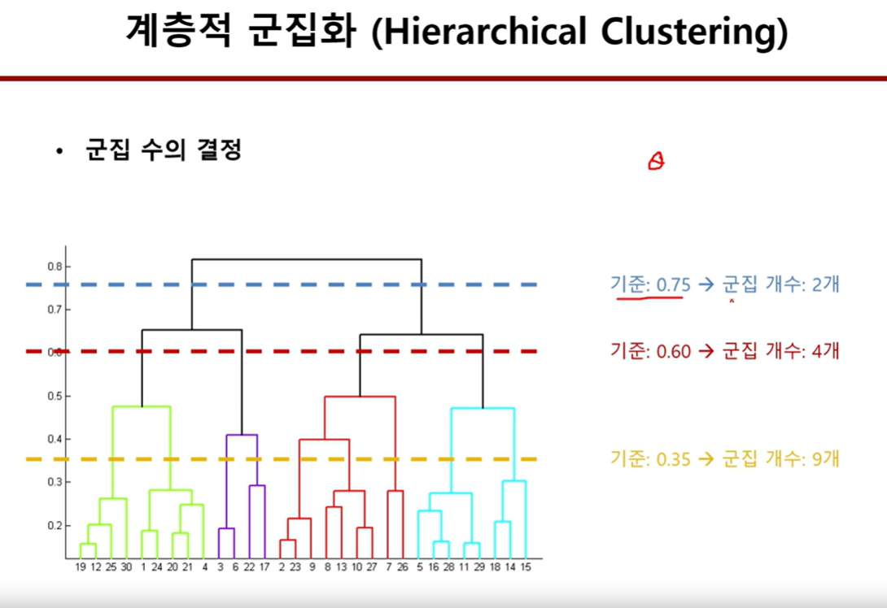
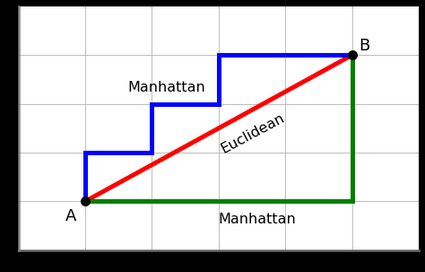
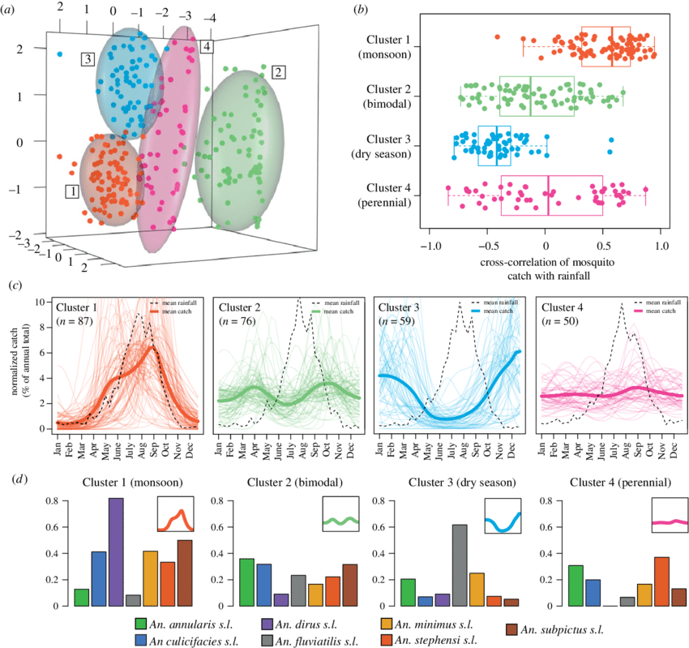
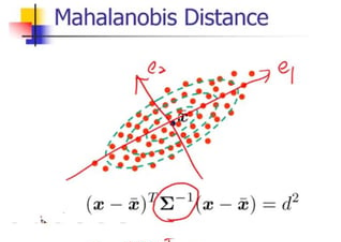
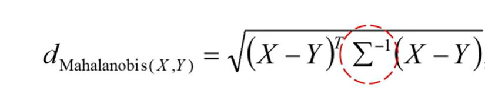
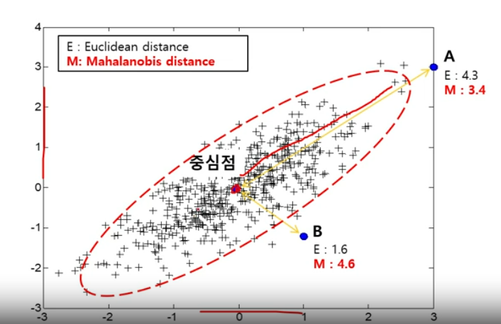
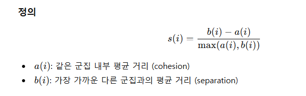
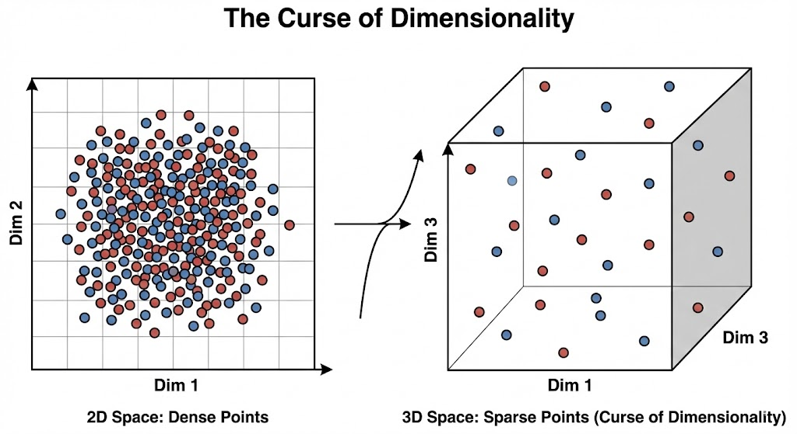
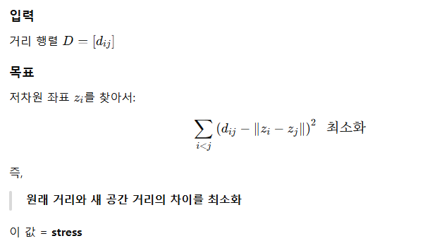
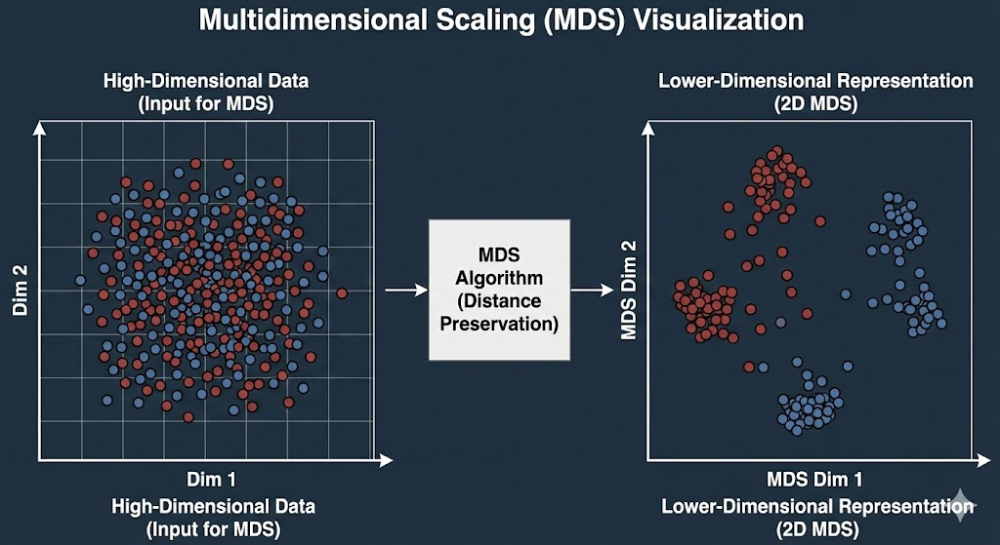

# week4 차원축소

## 키워드
```
- 다중공선성, 차원의 저주
- 전진선택, 후진소거, Stepwise
- PCA, MDS
```


## 군집화 - Unsupervised Learning(비지도학습)
* 정답 label y 가 없을때 사용
* feature 에 따라서 그래프에서 data 들이 뭉치는 현상
* 중심점 : cluster 의 각 점부터 중심점을 구함 (x좌표 /n , y좌표/n)
* Sum of Distance : cluster 의 중심점으로 부터 각점까지의 거리
    * sum of distance 가 최소가 되는게 좋은 군집화

### 종류
* hard / soft : 군집의 범위 overlap 여부 (hard 는 군집 A이며 B일수 없다  vs soft는 확률적 할당 AnB 가능)
1. Exhaustive search : 모든 경우를 다 보는
2. greedy search : 몇개만 보는데 near optimal 찾는
3. approximate search : 
4. Partitional clustering algorithms
    * 전체 데이터를 정의된 기준에 의해 한번에 구분
5. Hierarchical clustering algorithms
* 개체들을 가까운 집단부터 차근차근 묶어 나가는 방식
* 가까운 애들끼리 먼저 묶으며 시작
    * **agglomerative(상향식)** : bottom up (묶어서 cluster를 만듦)
        
    * divisive : top down (분리해서 세분화된 cluster를 만듦)
6. Density-based clustering algorithms
    * 관측치 간 density 를 기준으로 군집화

### clustering 기준

* 유클리디안 거리
* 맨해튼 거리
 
* 상관계수  

* 마할라노비스 거리

> data 간 거리를 나타내는데, 유사성이 높으면 거리가 가까워야함 -> 공분산의 역행렬을 곱한 유클리디안 거리

> 공분산 행렬(cor 행렬)을 고려한 거리 -> 타원으로 dominant vector 가 있는 쪽으로 길게 표시되고, 타원으로 더 멀리 떨어져있으면 거리가 더 김

### objective function
* argmin Loss 이지만, SSE 가 최소는 군집화를 안할때 이므로 `Elbow Point` 를 찾는 것으로 함
* Elbow point : SSE 가 크게 줄어들기 시작하는 지점 이라고 통상적으로 사용
    * 여러개 일 수도 있음 : 직접해보며 찾아야함
    * 실무에서 obj function은 보통 미분불가능함 (현실 데이터를 정의하는 f(x)는 존재하지 않으므로) &rarr; 타협점을 잘 찾아야함 - 휴리스틱

### 평가
#### 관점
1. External : 정답 label 과 비교하여 평가 &rarr; 현실적으로 불가
2. Internal : 군집 내의 데이터 간의 거리가 작고, 군집 간의 거리가 크면 좋은 군집화 라고 평가
3. Relative : k, elbow point 등 파라미터를 바꿔서 생성된 군집을 비교 평가하는게 relative 평가

#### 기법
* SSE : squared sum error
* silhouette : scale( 군집 간 거리 - 군집 내부 거리 )  : (-1,1) 0.5 이상이면 좋다고 평가


## K Means Algorithm
1. K개의 centroid(중심점) 설정
2. 각 데이터(점)를 가까운 centroid로 할당
3. centroid 를 점들의 평균 위치로 재설정
4. 변화가 거의 없을때 까지 반복

#### 장점
* 빠른 계산 속도
* 구현 쉬움
* 대용량 데이터에 적합

#### 단점
* K 설정 필요
* 초기 세팅에 매우 민감 : 이에 따라 다른 결과가 나올 수 있음
* 서로 다른 크기의 군집을 찾기 어려움
* 다른 밀도의 군집을 찾기 어려움
* 지역적 패턴 감지가 어려움

## DBSCAN
> Density Based Spacial Clustering Algorithm with Noise
* e(입실론) : 이웃점 탐색 반경 
* minPts : 반경 내 최소 이웃점 수 (최소 수를 만족해야 cluster 로 인정해줌)

    * core point : minPts 이상의 이웃점들을 가진 점 (말 그대로 core 핵심 point)
    * border point : 반경 e 안에 이웃 개수는 minPts 이하 이지만 어떤 core의 e 반경 안에 들어가는 점(기생하는 점)
    * noise point : minPts 이하의 이웃점들을 가진 점 (걍 noise)
#### 장점
* 노이즈에 강함
* 지역적 특성을 잘 잡음
#### 단점
* 다양한 밀도의 군집을 찾기 어려움
* 하이퍼파라미터 e, minPts 에 예민함
* 고차원 데이터에는 부적절(2d 정도만 가능)


## morphology
* 데이터를 형상학적으로 처리 
* 다른 개념: sequential 
#### usage
* 0/1 이분적인 데이터
* 글자, 이미지, 음성 데이터
#### 연산
* Erosion : 침식 (노이즈 줄임)
* Dilation : 팽창 (뚱뚱하게 만듦 -> 선 강조)
    * Opening : Erosion -> Dilation
    * Closing : Dilation -> Erosion


## 다중공선성 (multicollinearity)
* 말 그대로 multi-colinearity : 선형성이 여러개임
* 변수 x1,x2 등 여러개가 강하게 연결되어 있음 (예: 가격, 판매량)
    * 선형 종속성

#### 왜 문제가 되느냐?
* 예측 모델 `f(x)^` 의 성능을 해치진 않음
* `회귀 계수`에서 문제가 있음 : 다른 변수 고정시키고, 하나의 변수만 변화시켰을 때의 y값이 어떻게 변하는가?
    * 각 변수들과 y^ 값의 `관계`에 대해서는 x1,x2가 선형 종속성을 띄기 때문에 해석이 불가능
    * 순수한 x1의 효과를 설명할 수 없음 
* semantic model (설명 가능한 model) 에서는 매우 큰 문제임   

#### 생길 수 있는 문제
* 회귀계수 값이 비정상적으로 큼
* 부호가 직관과 반대
* 유의하지 않게 나옴
* 데이터 조금만 바뀌면 계수 급변

#### 해결책
* x1,x2 중 하나 제거 &rarr; 해석력 회복
* x1,x2 통합 (가격 + 판매량 &rarr; 판매가)
* PCA : 직교하는 주성분 벡터들의 선형결합으로 표현
* 규제(penalty) : ridge / lasso

## 차원의 저주

* 차원이 늘어날 수록 clustering 이 사라짐 
> 차원이 증가함에 따라 데이터가 공간에서 희박해지고, 거리 및 밀도 기반 학습 알고리즘의 성능이 급격히 저하되는 현상 
* 유클리드 거리를 쓰는데 차원이 높아지면 거리가 크게 변함
* dense 해보이던 점들도 사실 고차원에서 보면 sparse 한 데이터였음
* 이에 따라 neighbor를 찾으려해도 찾아지지 않음 &rarr; 거리기반 clustering 에 치명적


### 차원축소
* 변수가 너무 많으면 `가시화`/ `해석` / `분석` 어려움 &rarr; 차원 축소를 통해 이를 용이하게 만듦
* PCA, MDS


## PCA : Principal Component Analysis

* 데이터를 가장 잘 설명하는 직교하는 벡터들에 데이터를 projection 하여 차원을 줄이는 선형변환 기법
* 주성분 : 데이터를 가장 잘 설명하는 벡터 (주성분 ~~~ 분산)  
* 주축 기준으로 데이터가 편입되기 때문에 변수는 무조건 독립적임 &rarr; 다중공선성 해결


## MDS : Multi Dimensional Scaling
> 데이터 간 ‘거리(유사도)’를 최대한 보존하도록 고차원 데이터를 저차원 공간에 배치

* `거리`를 최소화 함 
*MDS는 차원을 선택하는 알고리즘이 아니라 선택된 차원에서 가장 거리 구조가 잘 보이게 배치하는 알고리즘이다

* 2차원 데이터를 거리 구조가 가장 잘 보이게 배치함(점간 거리는 변하지 않음)
* 그렇다면 축은 뭔가? : 축은 전혀 의미 없음 &rarr; 거리 구조가 가장 잘 보이도록 알고리즘이 임의로 지정한 축
* 점 간의 거리만 중요한 알고리즘 &rarr; 분석에 용이해짐(시각화)


## 전진선택
> 아무 변수도 없는 상태에서 시작해서 성능을 가장 많이 개선하는 변수를 하나씩 추가
알고리즘 절차

빈 모델로 시작

𝑦=𝛽0
* 모든 ee 변수 중 하나씩 넣어보고

* 성능(AIC, BIC, Adjusted R² 등)을 가장 개선하는 변수 1개 추가

* 더 이상 개선되지 않을 때까지 반복

#### 장점
* 계산량 적음

* 변수 수가 많을 때 유리

* 시작이 단순

#### 단점
* 한 번 넣은 변수는 다시 못 뺌
* 초반 선택이 잘못되면 끝까지 영향


## 후진소거
* 모든 변수를 사용한 모델로 시작
* 성능을 가장 많이 개선하는 변수를 하나씩 제거
* 더 이상 개선되지 않을 때까지 반복

#### 장점
* 처음에 전체 구조를 고려
* 전진선택보다 안정적인 경우 많음
* 해석 중심 모델에 적합

#### 단점 

* 변수가 많으면 계산량 큼
* 표본 수 < 변수 수이면 시작 불가
* 한 번 제거한 변수는 다시 못 넣음
* 여전히 greedy → 전역 최적 보장 x

## Stepwise

* 전진소거 후진소거를 번갈아가며 반복
