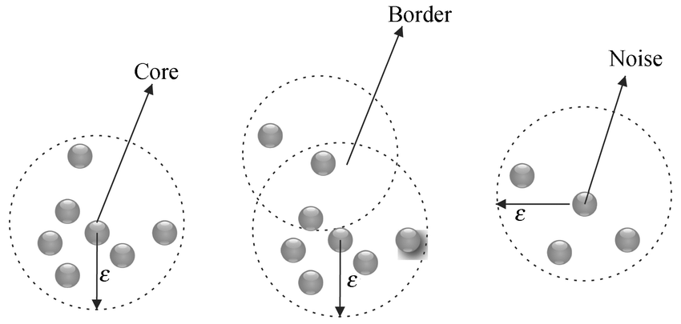
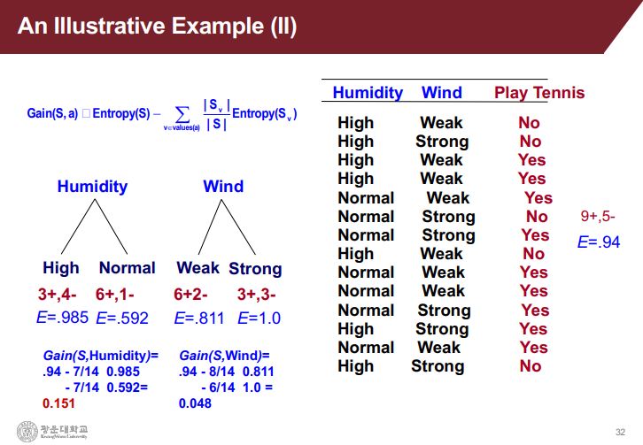
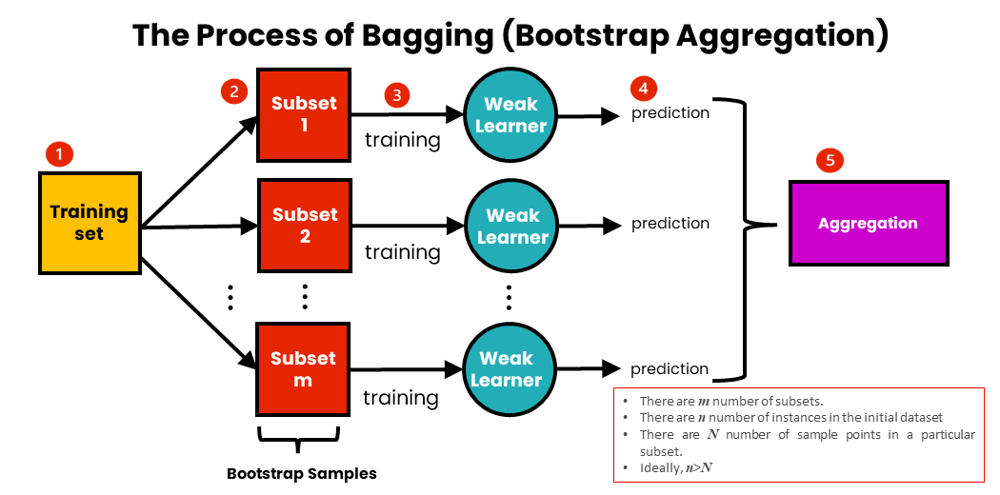
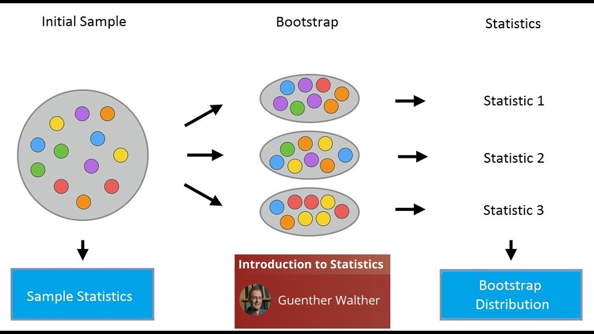
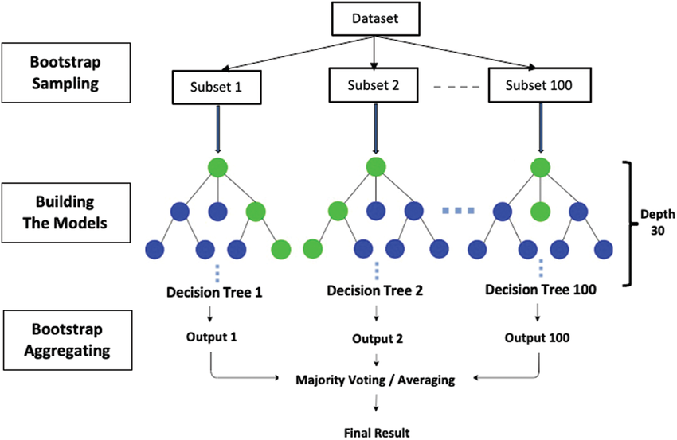
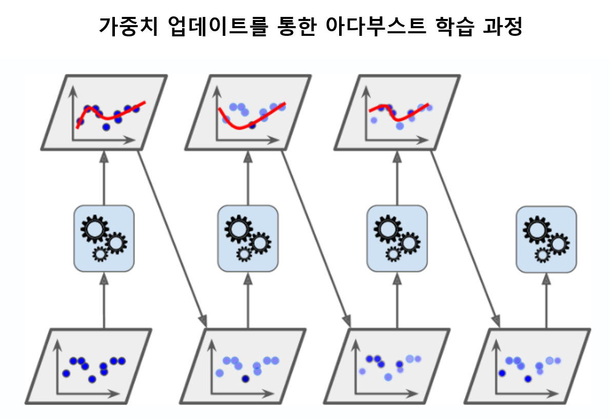
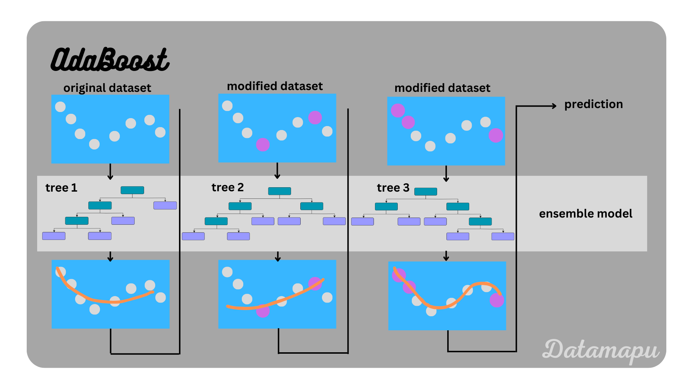
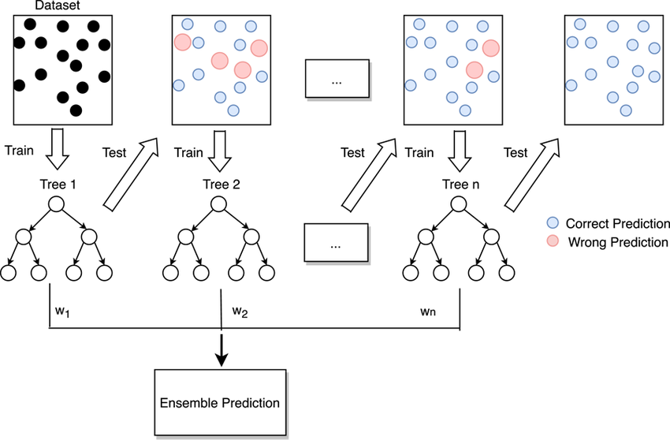
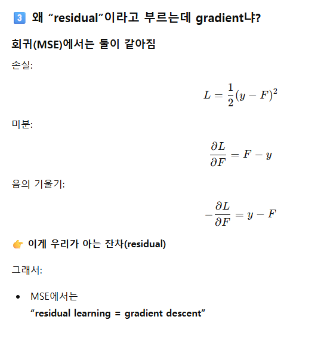

# Week5 비지도학습과 부스팅

* 비지도학습: 정답 label 이 없는 학습
* boosting : 약한 모델 여러개를 순차적으로 학습시켜서 이전 모델이 틀린 부분을 더 집중적으로 학습하게 하여 강한 모델을 만드는 ensemble(앙상블) 방법

## Keyword
```
 k-means, DBSCAN
 결정 트리, RF, 불순도, gini-index, entropy, Bagging
 AdaBoost, GBM
 XGBoost, LightGBM, CatBoost
```
---

## k-means
* 비지도 학습의 종류 (clustering)
> 데이터 간 거리/밀도를 먼저 잡는 방식
* data 와 centroid 의 SSE를 최소화
    * iteration이 지날수록 `centroid`가 데이터 `중심점`으로 이동됨

## DBSCAN 
* density-based clustering of applications with noise (밀도 기반 클러스터링 적용 with 노이즈)
> 데이터가 빽빽하게 모여 있는 영역은 하나의 군집, 주변에 이웃이 거의 없는 점은 노이즈로 본다.


* e(입실론) : 이웃점 탐색 반경 
* minPts : 반경 내 최소 이웃점 수 (최소 수를 만족해야 cluster 로 인정해줌)

    * core point : minPts 이상의 이웃점들을 가진 점 (말 그대로 core 핵심 point)
    * border point : 반경 e 안에 이웃 개수는 minPts 이하 이지만 어떤 core의 e 반경 안에 들어가는 점(기생하는 점)
    * noise point : minPts 이하의 이웃점들을 가진 점 (걍 noise)
#### 장점
* 노이즈에 강함
* 지역적 특성을 잘 잡음
#### 단점
* 다양한 밀도의 군집을 찾기 어려움
* 하이퍼파라미터 e, minPts 에 예민함
* 고차원 데이터에는 부적절(2d 정도만 가능)


---

## 결정트리 Decision Tree
* 특성이 가장 잘 나뉘는 기준을 찾아 노드를 분할하는 방식 &rarr; 타깃의 불확실성(불순도)를 최소화

> 어떤 기준으로 나누면 가장 잘 구분될까?”를 반복해서
트리(tree) 구조의 규칙을 만든다.
### 왜 나누는가?
* yes: 불순도/불확실성 을 낮춤 &rarr; 엔트로피 낮춤
* no: 특성 다양성을 높인다


## 불순도 impurity
`Decision Tree` 의 `Objective function`
* 불순도 high : 예측 쉬움
* 불순도 low : 예측 어려움

### 불순도 지표
1. gini-index
    * $Gini = 1 - \sum_{k=1}^{K} p_k^2$
    * 랜덤샘플링 하나 했을때 다른 class 일 확률

2. entropy
    
    * $Entropy = -\sum_{k=1}^{K} p_k \log_2 p_k$
    * 결과를 예측하기 얼마나 어려운가? like `포아송분포`(불확실성)
    * 내가 원하는 결과가 나올 확률이 얼마나 낮은가?(negative)
    

## gini-index vs entropy

| 항목  | Gini  | Entropy   |
| --- | ----- | --------- |
| 계산  | 빠름    | 느림 (log)  |
| 결과  | 거의 동일 | 거의 동일     |
| 민감도 | 둔감   | 희귀 클래스 민감 |

* entropy: 희귀 클래스 변화에 매우 민감함(1% -> 2% : 1% 변했지만 2배 변했다고 느낌)
* gini : 상대적으로 둔함
> gini 를 표준으로 사용

## bagging


* 아이디어: 같은 모델을 여러 data(bootstrap 가능)로 학습 시키고 응답값을 `평균/투표`로 결정
> Bagging = “같은 모델을, 다른 데이터로 여러 개 만들고 평균낸다”
* bagging을 하면 `overfitting`을 방지
* `high variance` 를 줄임 &rarr; `low variance`(robust)

### bootstrap

기존 data: [a,b,c,d,e]
bootstrap data: [a,a,b,c,e] (복원추출: 중복허용하여 sampling)
* bootstrap data로 기존 모델의 통계적 변동성/불확실성을 test
* data set 의 개수는 변하지 않음
* 같은 재료로 다른 요리를 하는 느낌
---

## random forest

> Decision Tree 를 여러개 만들고 aggregation(합침) 하여 예측을 평균/투표 하는 앙상블 모델
* 핵심 : bagging(bootstrap + ensemble 투표) + feature randomness(feature random sampling)

### 왜 random 인가?
1. bagging(bootstrap) : 데이터 random sampling
2. feature randomness : feature random sampling
    * feature(internal node의 분할 기준)선택 랜덤
    * 구조적 dropout 의 개념


### feature randomness 를 안하면 생기는 일
* feature randomness(bootstrap + feature sampling)
* `bagging` 만했을때는 데이터만 random sample 이라 트리 개수가 많아지면 결국 묶이는 상위 클래스는 비슷해짐
    * 거의 비슷한 트리들이 많아져 `overfitting`을 방지하지 못함 &rarr; `high variance`
* 여기서 feature까지 random 선택하여(like dropout) 트리의 다양성을 높임

### aggregation vs ensemble
* aggregation : 결합 규칙(ex: 평균, 다수결, 가중평균, stacking, etc..)
* ensemble : 여러 모델을 합쳐서 성능을 높이는 `방법`
    * ensemble = aggregation(결합규칙) + diverse models(모델)

* aggregation $\subset$ ensemble


---

## 부스팅(boosting)

* 전 모델에서 잡지못한 부분/틀린 부분 집중하여 모델을 추가하여 보완


* 각 모델은 성능이 약함 (1~3의 깊이 tree)
* 각각의 리프노드는 sample의 집합 
* split 시 기준점(thresholding value)에 대해서 split 
    * split 기준으로 집합이 나뉨

## AdaBoost [`a`-da-boost]

* 아이디어: 이전 모델이 틀린 샘플에 가중치↑ → 다음 약한 모델이 그 샘플을 더 맞추게 함
* 약한 학습기: 보통 얕은 트리(depth: 1)
* 특성
    * 개념/수학이 깔끔, 고전적
    * 노이즈/이상치에 민감(틀린 샘플에 가중치가 계속 커짐)
    * 노이즈를 포함하려 해서 noise sensitive
    * `overfitting`에 취약 (매 iter 포함 못한 data에 가중치를 추가하기 때문)


## GBM (Gradient Boosting Machine)

> 실무에서 가장 많이 쓰는 `XGBoost`, `LightGBM`, `CatBoost` 의 base가 되는 방법
* 아이디어: 여러 개의 약한 모델(보통 얕은 Decision Tree)을 순차적으로 학습시키며, 이전 모델의 오차를 다음 모델이 보정하는 앙상블 기법
* sequential 하겠네?
* Residual learning 의 개념
* loss F의 gradient descent 사용

### residual learning 인데 왜 gradient descent를 사용하는가?

> 회귀/예측(MSE) 에서만 둘이 같아짐
* 미분하면 residual = gradient 가 됨(수학적으로)


### hyperparameter dependent
* hyperparameter에 따라 성능이 크게 달라짐 &rarr; `fine-tuning`이 중요

1. learning_rate
2. n_estimators
3. max_depth
4. min_samples_split
5. min_samples_leaf
6. subsample
7. colsample_bytree

### Randomforest vs GBM
| 항목    | Random Forest | GBM       |
| ----- | ------------- | --------- |
| 목적    | 분산 감소(robust)         | **편향 감소(accuracy)** |
| 학습    | 병렬            | **순차**    |
| 랜덤성   | 강함            | 선택적       |
| 튜닝    | 쉬움            | **어려움**   |
| 고점 | 중~높음          | **매우 높음** |

* 실무에서 많이 사용되는 이유 : 정확한 예측을 위해


## XGBoost
> GBM을 “빠르고, 안정적이고, 실무 친화적으로” 확장한 고성능 트리 기반 부스팅 알고리즘
* 핵심은 2차 미분(Hessian) + 정규화 + 시스템 최적화
* 
### Hessian
* 1차 미분(gradient) : 방향
* 2차 미분(Hessian) : 크기 
    * 모두 써서 더 정확한 예측
    * 분할의 gain 을 hessian 으로 계산 &rarr; 더 안정적이고 일관된 분기 선택


### 규제(정규화)
* L1, L2 규제 사용
* 과적합 방지
목적함수에 트리 복잡도 패널티를 직접 넣음.

$$ L = \sum_{i} L(y_i, \hat{y}_i) + \underbrace{\gamma T + \frac{1}{2} \lambda \sum_{j} w_j^2}_{\text{트리 규제}} $$

* $T$: leaf 개수
* $w_j$: leaf 출력값
* $\gamma, \lambda$: 규제 강도

### 시스템 최적화
* 병렬 처리
* 캐시 최적화
* 아웃 오브 코어 학습

### 장/단점
#### 언제 쓰냐?
* 정형(tabular) 데이터
* 비선형·상호작용 많음
* 성능이 최우선
* 결측치/희소 데이터 존재
#### 단점
* 과적합에 취약
* 하이퍼파라미터 튜닝이 어려움
* 해석력 낮음(XAI 아님)

## LightGBM
> LightGBM = “leaf-wise로 가장 이득 큰 곳만 집중 분기해, 같은 트리 수로 더 높은 성능을 내는 고속 Gradient Boosting”
* gain을 계산해서 class 분할이 가장 이득되는 부분만 분할

| 항목    | GBM / XGBoost | LightGBM      |
| ----- | ------------- | ------------- |
| 트리 성장 | Level-wise    | **Leaf-wise** |
| 수렴 속도 | 보통            | **빠름**        |
| 성능 상한 | 높음            | **더 높을 수 있음** |
| 과적합   | 비교적 안정        | **주의 필요**     |
* GBM : breadth-wise &rarr; balanced tree
* LightGBM : leaf-wise &rarr; skewed tree


## CatBoost
> 범주형 변수를 `data leakage`없이 숫자(numerical data)로 처리 

* 순차적 처리
* 이전의 데이터를 보고 다음 결과를 예측 (prev state가 다음 결과 예측에 반영 like RNN)

### 왜 boosting인가?
* gradient를 근사하는 모델을 더해서 고쳐나감
