# Week 6 비선형 모델

## Keyword
```
activation function, sigmoid, ReLU
ShallowNN, DeepNN, AE
RNN, LSTM, Seq2Seq
```

## RNN : Recurrent Neural Network
* Recurrent : 반복적인 , 되풀이되는 , 재발
* Neural Network : 신경망
> 순서가 있는 데이터를 처리하는 신경망

순서가 있는 데이터 &rarr; 이전 상태(시간)가 다음 상태에 영향을 준다

```
끝말잇기 : 이전 단어(state)가 다음 단어(state)에 영향을 준다
```
* 조금 다른점 : 끝말잇기는 이전 단어에만 영향을 받지만 RNN은 과거에 있었던 모든 state(상태)를 input으로 받는다

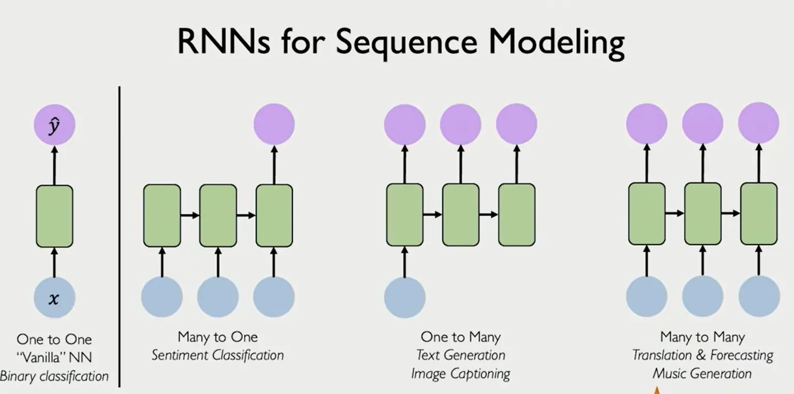

### 상태 전이
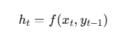

h(은닉층에서의 벡터) = x,y 의 state 들을 함수 f 에 넣은 값 

* RNN의 핵심 : 이전 state가 언제 다음 layer로 넘어가는가? &rarr; 초록 그림에서 input을 넣었을때 hidden layer 에서 다음 step의 hidden layer로 넘어감
#### 왜 output을 다음 input으로 전달하지 않는가?
* hidden layer로 전달하는게 벡터 이므로 더 많은 차원의 정보를 가지고 있음
* output은 softmax로 압축된 결과
* hidden layer &rarr; hidden layer가 온전한 정보 전달


### 종류
1. one to one
2. many to one 
    * input 이 여러개, 출력은 은닉층들을 거친 최종 결과 1개
3. one to many
    * 하나의 입력, 은닉층을 거칠때 마다 출력 (진행 상황을 보기 편함)
4. many to many
    * input을 매 스텝마다 받고, 그때마다 결과 출력함


### 장점
1. 이전 모든 스텝의 결과를 검토하여 output을 출력한다
2. 시간 흐름을 그대로 모델링 (문장, 음성, 시계열, 센서 데이터)

### 단점
1. **vanishing gradient** (역전파 시 chain rule 에 의해  : da/db * db/dc * ... &rarr; gradient 값이 작아짐 &rarr; 가장 앞 부분 소실되어 학습 불가)

    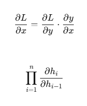
    * gradient는 sigmoid/tanh로 1보다 작음
2. encoding 병목 (input을 넣어줄때 벡터로 넣어줘야하므로, 압축되어 정보 손실이 일어남)
3. 병렬 학습 불가 (sequential 한 NN)
4. vanishing gradient 때문에 문장이나 시퀀스가 길면 불안정


## LSTM : Long Short Term Memory
* RNN의 vanishing gradient 를 해결하기 위해 gradient의 곱 형태가 아니라 `덧셈`을 사용함
> 아이디어: hidden state 를 두개로 나눈다 (출력용 state, 장기 메모리)


### 구조
1. forget gate
    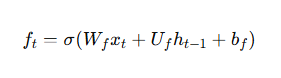
    * x: input_t
    * h : 이전 state_t-1
    * b : bias term
    > 과거 기억 중 얼마나 잊을/유지 할것인가
    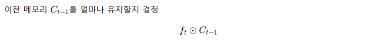 
      
2. input gate  
    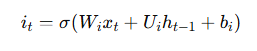  
    * x: input_t
    * h : 이전 state_t-1
    * b : bias term
    > 지금 들어온 정보중에 무엇을 기억에 추가할까
    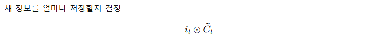 

3. Cell update (장기기억 C 항)
    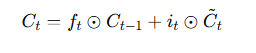 
    > 장기기억 cell = forget + input 의 가중합(조절가능한 파라미터)
    * 장기기억 C  = forget gate + input gate
    * element-wise operation + add


3. output gate
    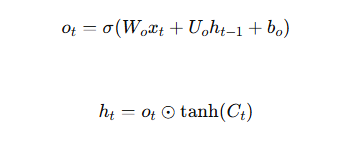 
    * x: input_t
    * h : 이전 state_t-1
    * b : bias term
    > C에 활성화함수를 씌우고 계산된 output 항을 곱해서 얼마나 정보를 c에서 내보낼지 결정

> LSTM의 세 게이트는 기억을 선택적으로 유지하고, 추가하고, 출력하는 확률적 제어 장치다.

### RNN과 다른점 
| RNN | LSTM |
| - | - |
| 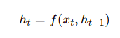 | 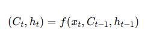 |
| f(input, prev_state) | f(input, prev_state)+ (**memory_cell**)
* 장기기억 메모리 cell : C를 추가해 미분 시 초반의 정보의 gradient 가 chain rule에 의한 소실이 일어나지 않도록 방지 함

### 장점
1. 장기 의존성 학습 가능: vanishing gradient 가 상대적으로 덜 일어남 &rarr; 먼 과거 정보 유지
2. 선택적 기억 유지 : forget gate, input gate, output gate 를 통해 정보의 흐름을 제어 가능
3. 긴 시퀀스에서 안정적 학습: ex(긴 문장 번역, 음성 인식, 시계열 예측)
4. 표현력 증가 (장기 기억항 c)
5. transformer 가 나타나기 전까지 sequential model의 표준

## Seq2Seq : Sequence to Sequence
입력 sequence 를 받아서 출력 sequence를 출력하는 모델

### 왜 필요한가?
* many to one (감정분석)
* many to many (길이 동일)  
seq2seq는 번역 처럼 입력 길이랑 출력 길이가 다른 모델

```
영어: I love you      (3 tokens)
한국어: 나는 너를 사랑해 (4 tokens)
```
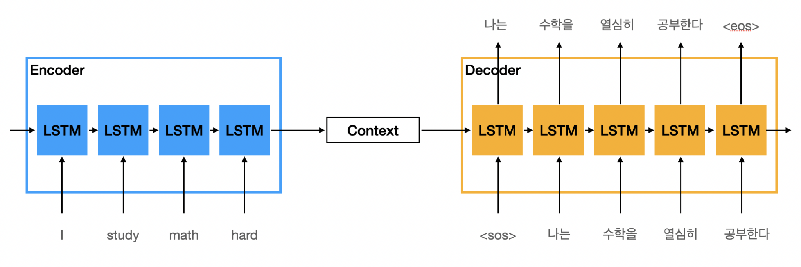
### Encoder
* LSTM 모델이 문장을 token 별로 받음
* 인코딩 하여 정보 벡터 `h`(context)로 압축하여 decoder로 전송  
    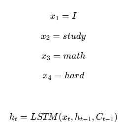

### Decoder
* 첫 input은 `<SOS>`(start of state)
    * `h` + `<SOS>` = `나는`
* 그 다음은 이전 출력 토큰을 입력으로 사용 


### 여전히 단점이 보임
* encoder to decoder 정보 전송이 일어날때 정보 벡터 h 로 압축하여 정보 손실이 나타남

### attention 개념의 등장

## Transformer : Attention is all you need
* google 에서 발표한 `attention is all you need ` 논문

원리 : self-attention
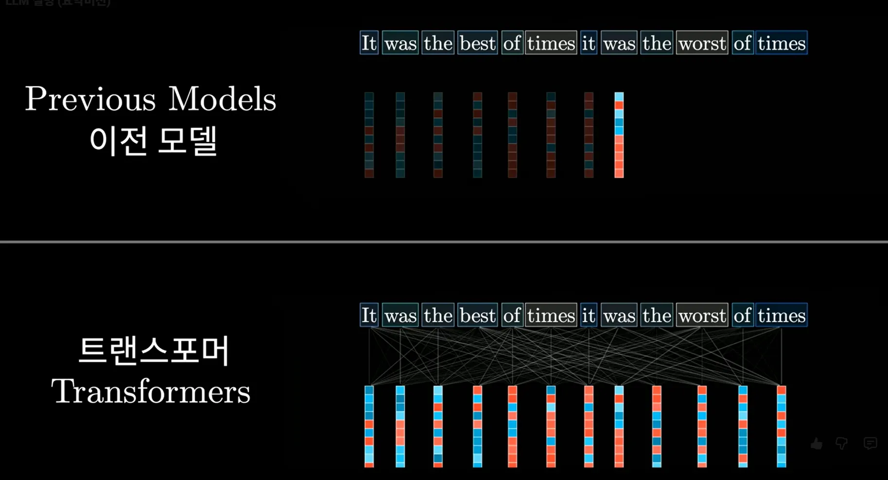
* 이전 : token 별 입력 (RNN 의 input)
* transformer : 문장/문맥 단위 attention

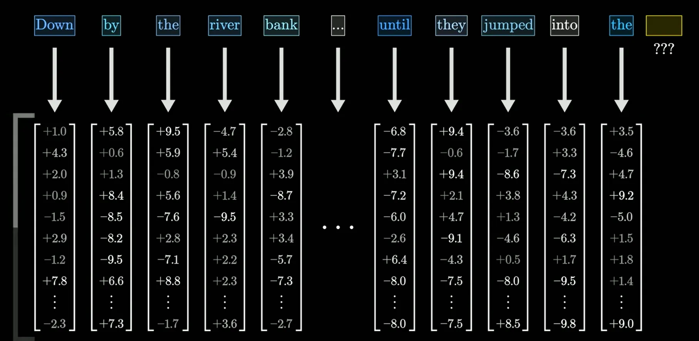
* attention 의 token을 벡터화

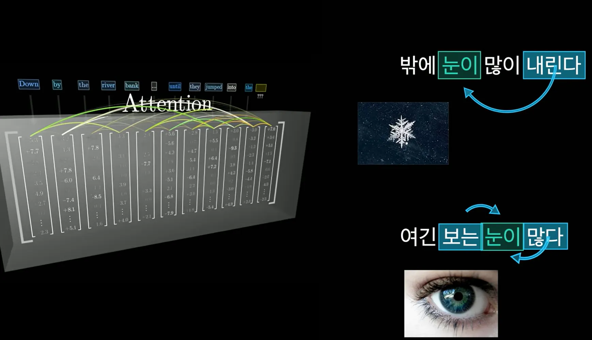
* 각 token 끼리의 관계를 계산
* attention layer : token vector들이 정보를 주고 받아 관계를 형성 하는 연산 layer/module
* adjacency matrix(관계행렬)과 비슷


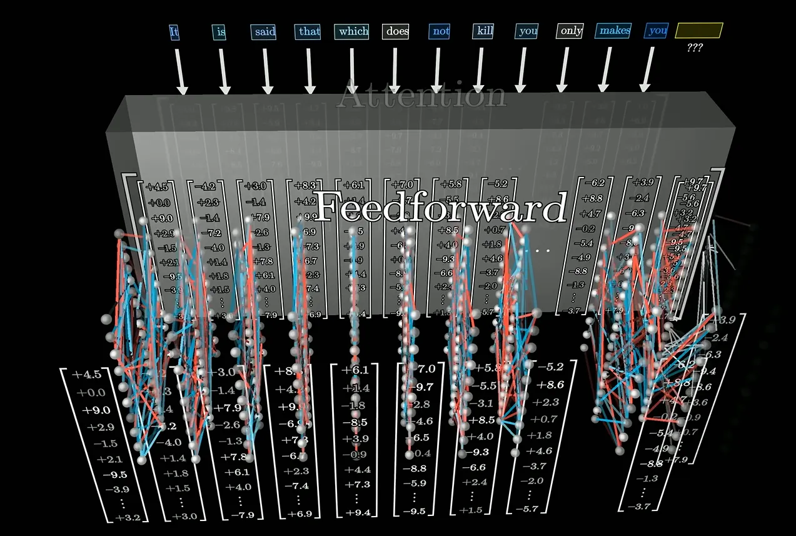
* feedforward 라는 것
* 비선형성을 추가하는 네트워크 &rarr; 토큰 간의 더 깊은 의미를 파악하는 네트워크
* attention은 선형 연산, FFN 은 비선형 연산


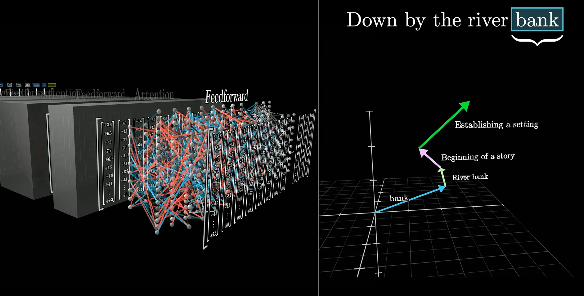
* 만들어진 벡터를 공간에 표현하면(그림은 예시)
* 실제 벡터는 수천 차원


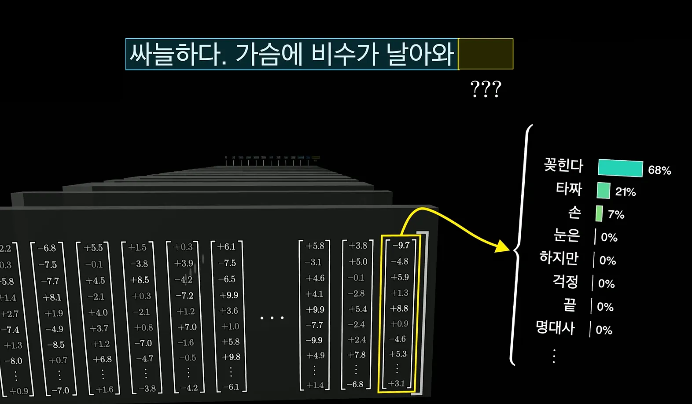
* 싸늘하다, 가슴에, 비수가, 등 모두 수천차원의 벡터.
* 모델은 예측 시 마지막 벡터 `날아와`를 보고 결정
* `날아와`의 벡터를 보고 softmax를 통해 각 선지들을 확률로 매핑 후 가장 큰 값 선택

### 그렇다면 RNN의 h를 보고 결정하는거랑 뭐가 다른지?
* RNN은 이전 state들을 `압축`했지만
* transformer은 `attention`에서 각 벡터들끼리 서로 문맥을 파악함
* 서로의 관계를 벡터로 나타냈음
* 전역참조의 개념


#### 신기했던 부분
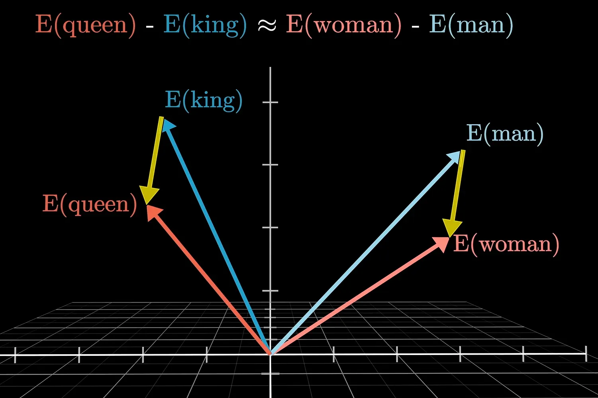
* attention 후 만들어진 벡터를 시각화 한 단계
* 위 그림처럼 king - queen 의 벡터가 man - queen 의 벡터와 매우 유사
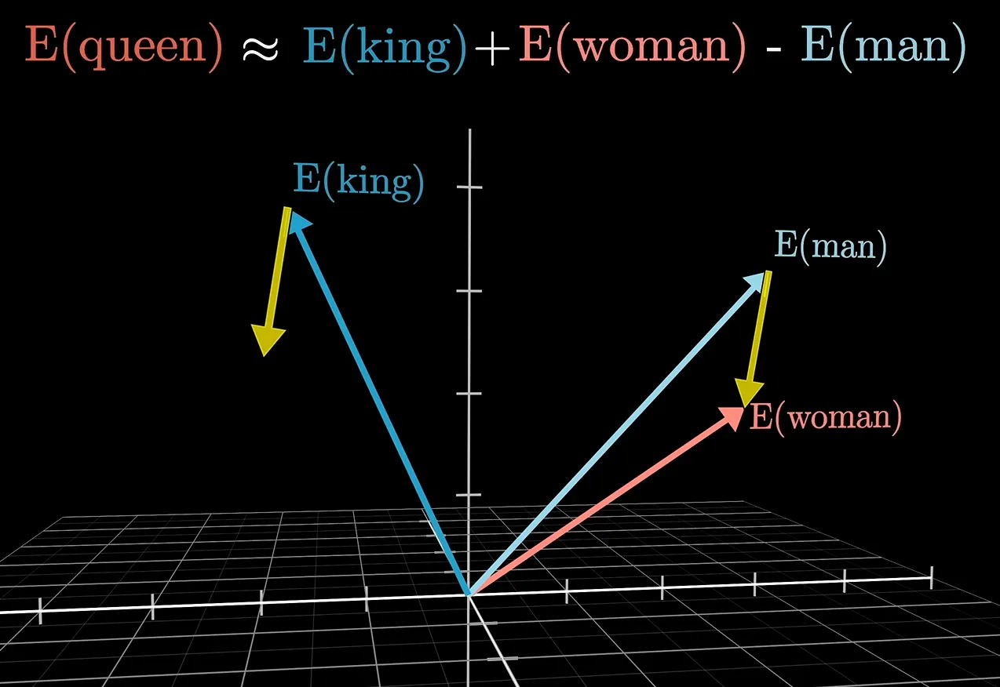
* 그래서 queen의 단어를 모른다고 했을때 transformer가 아래 식으로 예측 가능 하다고 함

```
queen(모름)= king + woman - man
```