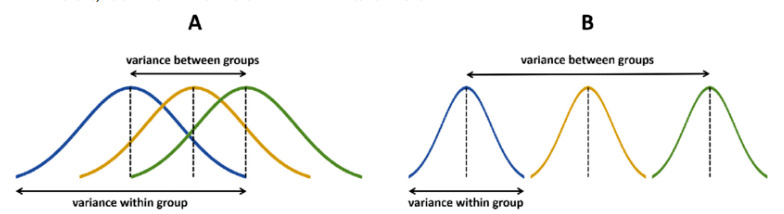
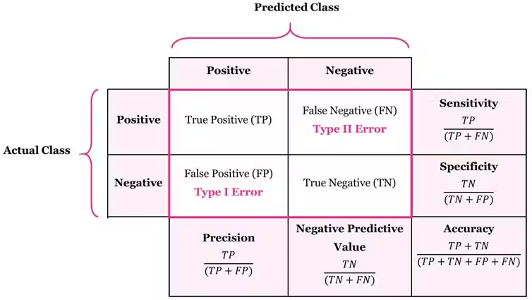
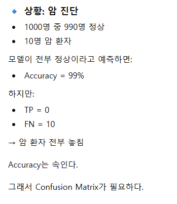
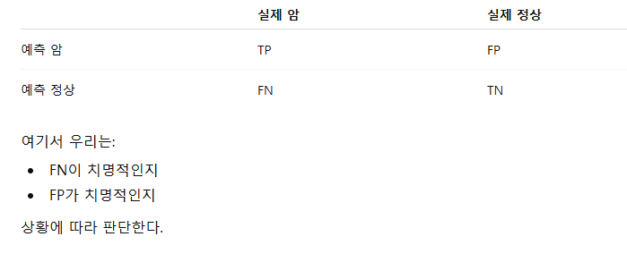
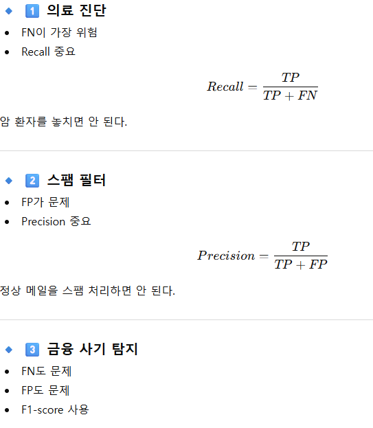

# Week 7 성능 평가 & XAI
```
 결정계수R^2, 수정결정계수 Adj R^2
 p-value, 분산분석ANOVA
 confusion matrix, f1 score
 PDP, ICE, LIME, SHAP
```

## 결정계수 R^2
정의 : 회귀 모델이 데이터 변동성을 얼마나 설명하는지
* 설명력
$$R^2 = 1 - \frac{SS_{res}}{SS_{tot}}$$

* 1에 가까울수록 좋음
* 0이면 평균 예측 수준
* 음수 가능 (모델이 평균보다 못할 때)

### R square 가 음수?
* `설명력` 이니 `반비례의 관계` 아닐까 라고 생각이 듦
* 하지만 정의를 보면 
  * $SS_{res} = \sum (y_i - \hat{y}_i)^2$ : 값 - 추정값의 제곱의 합
  * $SS_{tot} = \sum (y_i - \bar{y})^2$ : 값 - 평균의 제곱의 합
* 즉, delta_예측이 delta_평균보다 크면 R^2이 음수가 나옴
> 결론 : 단순 평균을 통한 예측보다 못한 설명력

## 수정결정계수 Adj R^2
정의 : 결정계수에 변수의 개수를 고려한 값
> 변수를 여러개 넣고 차원을 확대 했더니 R^2이 증가 &rarr; 사실 수식에 의해 증가하는 것이지, 다른 차원으로 봤을때 설명력이 증가하는게 아님


* 변수가 많아지면 R^2는 무조건 증가
* 이를 보정한 값(저번에 배운 p-value와 같은 맥락)
$$\bar{R}^2 = 1 - (1 - R^2)\frac{n-1}{n-k-1}$$

* k : 변수의 개수
* n : 데이터의 개수


## p-value 
```
어떤 약이 효과가 없다고 가정(H₀)

실험 결과 평균 차이가 매우 크게 나왔다.
```
* p < 0.01 → 매우 유의 (예상대로 결과 좋음)
* p < 0.05 → 통계적으로 유의(나쁘지 않음)
* p ≥ 0.05 → 유의하지 않음 (실험 실패)

> p-value는 귀무가설이 참일 때 관측된 결과 이상이 나올 확률이며, 작을수록 해당 효과가 우연일 가능성이 낮다고 판단한다.

### ML vs 통계
통계:

* 변수 유의성 판단
* 통계 모델 해석 중심

ML:

* 예측 성능 중심
* p-value 잘 안 씀


## 분산분석 ANOVA
ANOVA = Analysis of Variance (분산분석)
> 여러 집단의 평균이 서로 같은지 검정하는 방법

### 왜 분산으로 평균을 검정하는가?

* 집단 내 분산 vs 집단 간 분산
* 집단 간 차이가 크다면, 집단 간 분산 > 집단 내 분산 일 것이다


## confusion matrix

* `조건부 확률`을 이용해 모델의 분류 지표를 평가
> 모델이 `어떤 종류`의 실수를 많이 하는지 분석할 수 있는 지표
### 정확도 만으로는 왜 부족한가?

### confusion matrix 하는 일

* 어떤 case 가 더 치명적인지 파악 가능




## f1 score
> 전체 1000개 데이터 중 990가 positive &rarr; 99% 정확도
* 모델은 확률에 따라 거의 `positive`로 예측
* 1%의 negative를 모두 놓침

이를 방지하기 위해 `불균형 데이터` 탐지를 하기 위해 f1 score를 사용(암, 사기, etc...)
* 조건부확률을 사용한 지표

| 장점 | 단점 |
| --- | --- |
| 불균형 데이터 탐지 | TN 고려 x |
| FP,FN 중요 | 다중 클래스 분류 어려움 |


## PDP (변수의 전체 샘플 평균)
Partial Dependence Plot (부분 의존성 지표)
> 특정 feature 가 모델 예측에 미치는 `평균적 영향`

### 왜 필요한가?
* Random Forest
* XGBoost
* Neural Network

위 모델들은 내부가 `블랙박스` : 알수없음(not XAI)
> 변수 영향 시각화/지표화 /`역산`

## ICE (개별 샘플)
Individual Conditional Expectation plot
> 특정 변수가 모델의 예측값에 미치는 영향을 그래프로 나타낸 것

### PDP와의 차이점
* 변수 x의 샘플 x1,x2,x3... 에 대해 모두 그래프가 나옴
* PDP는 변수 x의 모델에 대한 영향력만 나옴

| 항목 | PDP    | ICE   |
| -- | ------ | ----- |
| 결과 | 평균 곡선  | 개별 곡선 |
| 장점 | 간단     | 상세 분석 |
| 단점 | 이질성 숨김 | 복잡    |


## LIME
Local Interpretable Model-agnostic Explanations
> 특정 샘플에 대한 모델의 예측을 사람이 이해가능한 방식으로 설명

* Local → 특정 한 데이터 포인트 주변
* Interpretable → 사람이 이해 가능한 방식
* Model-agnostic → 어떤 모델이든 사용 가능

> XAI 의 역할 : 왜 예측확률이 92%인지 설명할 수 있어야함


## SHAP
SHapley Additive exPlanations
* 게임 이론에서 유래한 `SHAP`

* 여러 플레이어가 만든 총 보상을
각 플레이어에게 공정하게 나누는 방법

> 각 feature가 예측값에 얼마나 기여했는지 “공정하게” 분배한다.

### 등장 배경
LIME은:

* 지역적 설명
* 샘플링 기반 → 불안정 가능

SHAP은:

* 이론적으로 정당한(feature contribution의 공정한 분배) 설명을 제공

### 종류
* TreeSHAP

XGBoost, Random Forest에 최적화

빠름

* KernelSHAP

모델-agnostic

느림

### 언제 쓰는가?

* 금융 모델 설명
* 의료 AI 설명
* 모델 신뢰성 확보
* 규제 대응 (Explainable AI)

### 한계

* 계산량 많음
* feature가 많으면 느림

변수 상관관계 문제 완전 해결은 아님